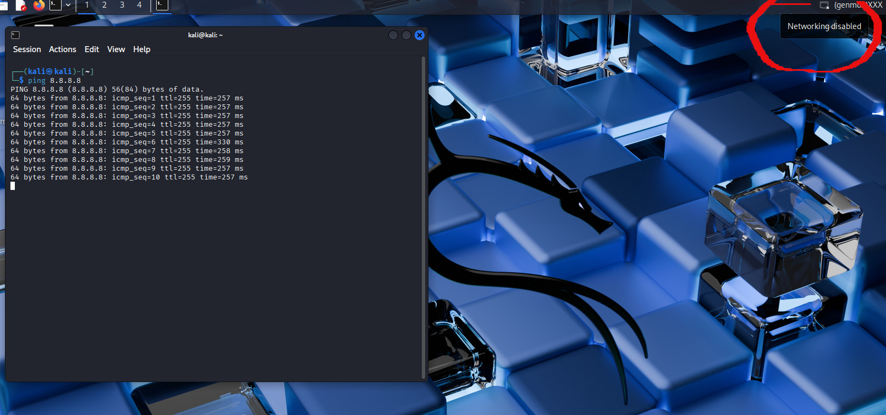
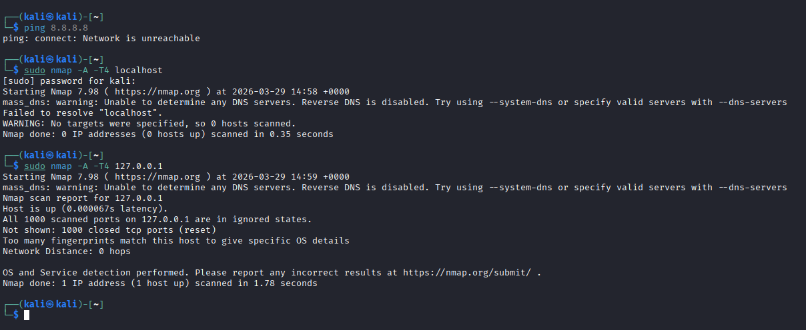
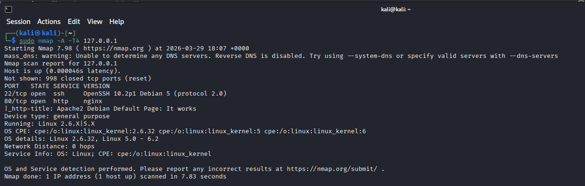
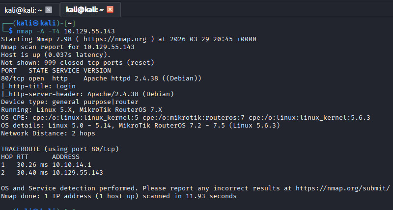
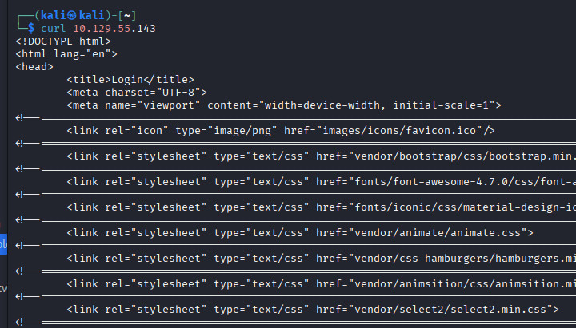
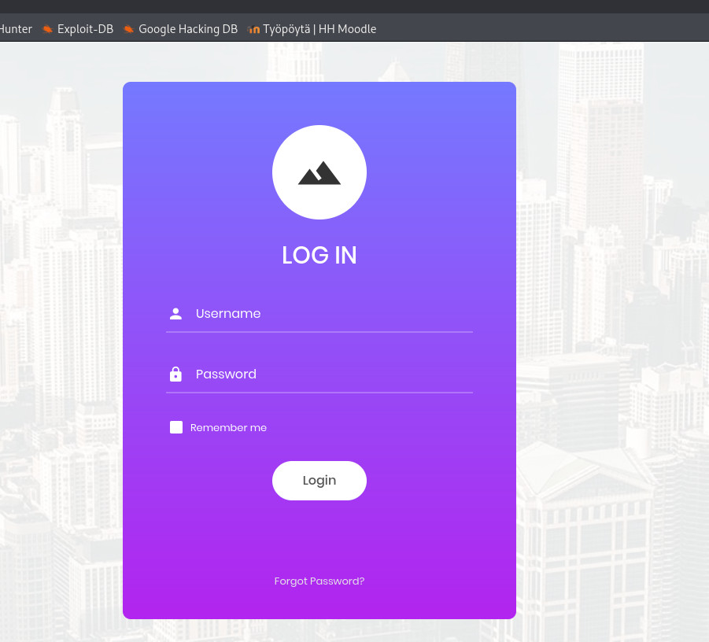
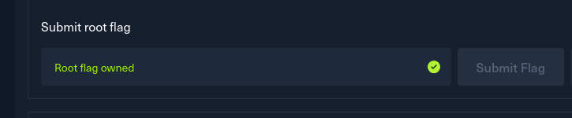

## h1 Kybertappoketju 

Tehtävänanto: [https://terokarvinen.com/tunkeutumistestaus/#h1-kybertappoketju](https://terokarvinen.com/tunkeutumistestaus/#h1-kybertappoketju)

*x) Lue/katso/kuuntele ja tiivistä.*

Kuuntelin [Darknet Diaries -podcastista jakson 165: Tanya](https://darknetdiaries.com/episode/165/)

- Tanya Janca oli sovellusten kehittäjä, joka kiinnostui sovellusten tietoturvasta sen jälkeen, kun joku näytti miten hänen kehittämänsä ohjelman pystyi hakkeroimaan.
- Janca kertoo mielenkiintoisia ja hauskojakin tositarinoita, joita en viitsi spoilata
- Yhteisenä teemana tarinoissa on ihmiset, ja se että työntekijät tulee kouluttaa toimimaan oikein. Muuten voi joutua tilanteeseen, jossa tuhoaa asiakkaan tietoja, kun ei tiedä tekevänsä tunkeutumistestausta tuotannossa olevaan järjestelmään...
- Vähemmän hauska tarina liittyy siihen, kuinka työntekijä tuhosi todisteita vakavasta rikoksesta, koska ei tiennyt, miten tilanteessa olisi pitänyt toimia.

*[Hutchins et al 2011: Intelligence-Driven Computer Network Defense Informed by Analysis of Adversary Campaigns and Intrusion Kill Chains, chapters Abstract, 3.2 Intrusion Kill Chain.](https://lockheedmartin.com/content/dam/lockheed-martin/rms/documents/cyber/LM-White-Paper-Intel-Driven-Defense.pdf)*

- Kill chain -malli kuvaa kyberhyökkäyksen seitsemää eri vaihetta
- Hyökkäys alkaa tiedustelulla (1), eli kohteesta kerätään tietoja esimerkiksi avoimesta netistä. Sen jälkeen "aseistetaan" (2), eli käytetään jotain exploitia.
- Delivery-vaiheessa (3) tuo "ase" viedään kohteeseen esim. sähköpostiliitteenä, ja sitten "exploitation"-vaiheessa (4) käytetään hyväksi kohteen haavoittuvuutta
- Installation eli asennusvaiheessa (5) asennetaan esimerkiksi backdoor, jolla hyökkääjä saa pysyvän pääsyn kohteeseen. Sitten Command and Control -vaiheessa (6) hakkeroitu laite ottaa yhteyden "kotiin"
- Actions on Objectives -vaiheessa (7) suoritetaan se, mitä varten hyökkäys tehtiin, eli esim. varastetaan dataa

*Santos et al: The Art of Hacking (Video Collection): [4.3 Surveying Essential Tools for Active Reconnaissance.](https://learning.oreilly.com/videos/the-art-of/9780135767849/9780135767849-SPTT_04_00) Sisältää porttiskannauksen.*

- Aktiivisessa tiedustelussa aloitetaan ensin varovaisemmin, jotta ei herätetä huomiota
- Ensin esim. porttiskannattaan nmapilla, ja sen jälkeen tutkitaan tarkemmin, mihin kohteisiin pyritään tunkeutumaan
- Skannaustyökaluja ovat mm. nmap, masscan ja udpprotoscanner
- Eyewitness-työkalulla voi ottaa screenshotteja kaikista kohteen nettisivuista ja sitä kautta löytää mielenkiintoisimmat kohteet

*[KKO 2003:36](https://www.finlex.fi/fi/oikeuskaytanto/korkein-oikeus/ennakkopaatokset/2003/36). (Vain silmäily, ei tarvitse lukea kokonaan eikä varsinkaan tehdä syvällistä analyysia).*

- Tapauksessa 17-vuotias henkilö porttiskannaili pankin järjestelmiä, ja häntä syytettiin tietomurron yrityksestä
- Tapaus eteni korkeimpaan oikeuteen, jossa hänen tuomionsa ja korvaukset säilyivät
- Itse rangaistus ei minusta kovin kova ollut (sakkotuomio), mutta korvaussumma toki oli iso. 
- Petteri Järvinenkin on ottanut tuomioon kantaa: https://www.fredman-mansson.fi/fi/henkilosto/markku-fredman/kirjoituksia/19-kirjoituksia/markku/194-tietomurto. 

*a) Asenna Kali virtuaalikoneeseen. (Jos asennuksessa ei ole mitään ongelmia tai olet asentanut jo aiemmin, tarkkaa raporttia tästä alakohdasta ei tarvita. Kerro silloin kuitenkin, mikä versio ja millä asennustavalla. Jos on ongelmia, niin tarkka ja toistettava raportti).*

Olen aiemmin asentanut Kalin Oracle Virtual Boxiin: [Pre-built Kali VirtualBox VM](https://www.kali.org/get-kali/#kali-virtual-machines). Alkuperäinen versio 2025.2, nykyinen 2026.1. 

*b) Irrota Kali-virtuaalikone verkosta. Todista testein, että kone ei saa yhteyttä Internetiin (esim. 'ping 8.8.8.8')*

Poistin verkkoyhteyden käytöstä Kalin oikeasta ylälaidasta ja testasin samalla, että pingaus pysähtyi. Testasin myös, että selainkaan ei ladannut nettisivuja.

*c) Porttiskannaa 1000 tavallisinta tcp-porttia omasta koneestasi (nmap -T4 -A localhost). Selitä komennon paramterit. Analysoi ja selitä tulokset.*

Tein ensin tehtävässä mainitun komennon, mutta sillä en saanut tuloksia. Vaihdoin sitten localhostin kohdalle IP-osoitteen 127.0.0.1.

Parametrit (lähde: man nmap):  
-A - selvittää käyttöjärjestelmän, version, skriptit ja tekee tracerouten.  
-T4 - numerot 0-5 kontrolloivat skannauksen nopeuden. Hitaimpia käytetään, kun ei haluta herättää huomiota, ja ne kestävät pitkään. T3 on oletusnopeus ja T4 on sitä jonkin verran nopeampi. Manuaalin kirjoittaja suosittelee nopeutta T4.

Tulokset:
Unable to determine any DNS servers - nmap ei löytänyt DNS-palvelimia, mutta konehan olikin irti verkosta  
Host is up - nmap sai vastauksen hostilta  
Tuloksissa sanotaan, että kaikki portit ovat closed ja myös "in ignored states". Jälkimmäiseen en löytänyt ytimekästä selitystä, nmap siis kai ignoorasi portit.  
Too many fingerprints match this host - nmap ei pystynyt tunnistamaan käyttöjärjestelmää  
Network Distance: 0 hops - nmap toimi samassa laitteessa kuin kohde  

*d) Asenna kaksi vapaavalintaista demonia ja skannaa uudelleen. Analysoi ja selitä erot.*

En asentanut uusia demoneita, mutta käynnistin ssh:n ja nginxin komennoilla ``sudo systemctl start ssh`` ja ``sudo systemctl start nginx`` ja tein uudelleen saman nmap-komennon.

Nyt tuloksissa ei näy ignoorattuja portteja vaan 998 suljettua porttia, ja lisäksi erikseen kaksi avointa porttia.

22/tcp open ssh - portissa 22 näkyy Open SSH, joka siis kuuntelee SSH-protokollan oletusporttia 22  
80/tcp open http - päälle laittamani Apache2-webbipalvelin kuuntelee porttia 80, jota käyttää http- eli tavallinen nettisurffausliikenne

Jostain syystä nmap on nyt myös pystynyt selvittämään käyttöjärjestelmän (Linux), vaikka aiemmin se ei siihen kyennyt.

*e) Ratkaise vapaavalintainen kone HackTheBoxista. Omalle tasolle sopiva, useimmille varmaan Starting Pointista. Valitse kone, jota et ole ratkaissut vielä. Ei tunnilla näytetty Meow.*

Valitsin Appointment-boxin, jossa aiheena oli SQL-injektio.

Ensin tehtävänä oli muutamia kysymyksiä, joihin vastaus löytyi netistä, jos ei muuten tiennyt. 

Ensimmäinen varsinainen hakkeritehtävä oli selvittää, mikä palvelu ja sen versio on kohdekoneen portissa 80. Tutulla komennolla ``sudo nmap -A -T4`` portista 80 löytyi Apache.

Toinen (ja viimeinen) hakkerointitehtävä oli kirjautua kohdekoneeseen ilman, että tietää salasanaa. Pähkäilin ensin, että miten minä sieltä mitään nettisivua edes näen. Nmap-skannauksessa oli näkynyt http-title Login, ja katsoin curlilla, että kohteen IP-osoitteessa tosiaan oli jokin HTML-sivu, jossa on sisäänkirjaantuminen.

Sitten keksin mennä siihen kohteen IP-osoitteeseen selaimella, koska olinhan samassa verkossa. Siellä näkyi login-sivu.

Tehtävässä käskettiin "käyttää kommenttia" sisäänkirjautumisessa, koska se ikään kuin pyyhkii SQL-lauseen loppuosan pois. Kokeilin laittaa hashtagia admin-sanan perään, niin kuin vinkissä neuvottiin. Hölmösti yritin aika monta kertaa niin, etten laittanut salasanaksi mitään, vaikka lomakkeella selvästi oli tarkistus sille, ettei salasana saanut olla tyhjä.

Lopulta etsin tietoja netistä SQL-injektioista ja kommenteista niissä. Yhdestä [Medium-artikkelista](https://medium.com/@sobatistacyber/picoctf-writeup-web-gauntlet-7c3b8c7c7946) tajusin vihdoinkin sen, että salasanan piti kirjoittaa jotain. Kyseisen artikkelin mukaisesti tehtynä lopulta onnistuin, eli siinä käytettiin muotoa ``admin' --", minkä jälkeen kirjoitin jotain siansaksaa ja lisää siansaksaa salasanaksi. 

Kyselin lopuksi vielä ChatGPT:ltä, että miksi pelkkä ``admin' --`` käyttäjänimi-kentässä ei riittänyt, ja se selitti, että viivojen jälkeen pitää tulla "jotain", vaikka sitten tyhjä väli tai tekstiä, jotta SQL käsittelee sitä kommenttina. Ja lopuksi kokeilin tehtävässä mainitulla hashtagilla, eli silläkin se toimi, kunhan vaan olisi tajunnut laittaa adminin jälkeen `'`. SQL-injektiotaitoni ovat näemmä aika ruosteessa, ja minun olisi pitänyt lukea niistä enemmän, ennen kuin yritin hakkerointia.
