## h2 DORA the Explora

Tehtävät: [Dora the Explora](https://terokarvinen.com/tunkeutumistestaus/#h2-dora-the-explora)

*x) Lue/katso/kuuntele ja tiivistä.*  
*[Buuri 2026: DORA and TLPT testing - Lecture for Haaga-Helia on 31 March 2026 (pdf, 2 MB)](https://terokarvinen.com/buuri-2026-dora-and-threat-lead-penetration-testing/buuri-2026-dora-and-threat-lead-penetration-testing--teros-pentest-course.pdf)*

- DORA on tammikusssa 2025 voimaan tullut EU-asetus, joka säätelee finanssisektorin tietoturvaa
- Kaikkia alan toimijoita koskee tietynlaiset testaukset ja tärkeimmät toimijat joutuvat myös järjestämään tunkeutumistestauksia järjestelmiinsä
- Suomen Pankki ylläpitää TIBER-FI-kehystä, joka noudattaa DORAa, ja jota käytetään red team -testauksessa
- Testauksessa on yleensä mukainen ulkopuolinen red team, organisaation sisäinen control team, sekä organisaation IT-henkilöstö eli blue team
- Jotta päästään testaamaan myös sisempiä järjestelmiä, voidaan testaustiimiä avittaa niin, etteivät he jää kiinni heti ovella
- DORA vaikuttaa järkevältä tavalta pyrkiä varmistamaan, että finanssisektorin toimijat toteuttavat testejä omia järjestelmiään kohtaan, kun taas GDPR on käsittääkseni vähemmän konkreettinen.
  
*[DORA (Regulation ... on digital operational resilience for the financial sector)](https://eur-lex.europa.eu/eli/reg/2022/2554/oj/eng) :*  
*- Article 26 "Advanced testing of ICT tools, systems and processes based on TLPT"*  
*- Article 27 "Requirements for testers for the carrying out of TLPT"*  

- Tiettyjen finanssialan toimijoiden tulee osallistua kolmen vuoden välein tunkeutumistestaukseen, joka toteutetaan tuotannossa oleviin järjestelmiin
- Testaamisessa käytetään yleensä ulkopuolisia testaajia
- Testaajilla täytyy olla korkea osaaminen tunkeutumistestauksessa 

*[TIBER-FI procedures and guidelines (pdf, 1 MB)](https://www.suomenpankki.fi/globalassets/bof/en/money-and-payments/the-bank-of-finland-as-catalyst-payments-council/tiber-fi/tiber-fi-2.0-procedures-and-guidelines.pdf)):*  
*5.4 Testing phase: Red team testing*  

- Red team toteuttaa kyberhyökkäyksen eri vaiheita alkaen tiedustelusta ja päättyen etukäteen sovittuun kohteeseen
- Testaamisen kohdeorganisaatio voi antaa testaajille sellaista tietoa, jota testaajat eivät itse pystyisi laillisesti hankkimaan tiedustelulla, koska oikeat hyökkääjät voisivat kerätä tietoja myös laittomasti ja käyttää siihen myös enemmän aikaa kuin mitä testaamiseen on varattu
- Myös testauksen aikana voidaan red teamille antaa sellaisia tietoja, joita myös mahdollinen hyökkääjä voisi hyökkäyksen aikana saada

*Vapaaehtoinen bonus: [Buuri 2026: D26 - Releasing Your Inner TIBER in Regulated Adversary Simulations](https://youtu.be/z6KIEEknKjM).*
- Videon sisältö on lähes sama kuin mitä kuultiin luennolla
- Tällä kertaa kuuntelusta jäi mieleen se, että control tiimiin kuuluu myös muita kuin kohdeorganisaaation IT-puolen väkeä, eli myös ns. businesshenkilöstöä, ja kommunikaation pitää toimia hyvin, jotta control team tietää mitä testaajat tekevät, koska kyseessä ovat tuotannossa olevat järjestelmät.

**a) Asenna Metasploitable 2 virtuaalikoneeseen.**

Latasin Metasploitablen sivulta [https://www.rapid7.com/products/metasploit/metasploitable/](https://www.rapid7.com/products/metasploit/metasploitable/). 

Asensin sen näiden ohjeiden mukaisesti [https://medium.com/cyber-collective/setting-up-metasploitable-in-virtualbox-on-kali-linux-1d5c3212f7f3](https://medium.com/cyber-collective/setting-up-metasploitable-in-virtualbox-on-kali-linux-1d5c3212f7f3).

Eli lisäsin zip-tiedostosta puretun VM:n Virtual Boxiin, tyypiksi laitoin Linux ja versioksi Other Linux.  

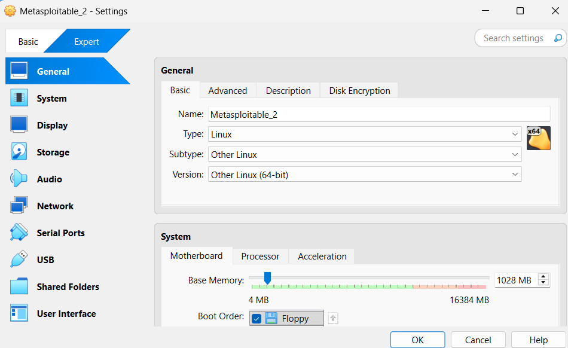

*b) Tee Kalin ja Metasploitablen välille virtuaaliverkko. Jos säätelet VirtualBoxista*  
*Kali saa yhteyden Internettiin, mutta sen voi laittaa pois päältä*  
*Kalin ja Metasploitablen välillä on host-only network, niin että porttiskannatessa ym. koneet on eristetty intenetistä, mutta ne saavat yhteyden toisiinsa*  

Edelleen [tätä ohjetta](https://medium.com/cyber-collective/setting-up-metasploitable-in-virtualbox-on-kali-linux-1d5c3212f7f3) mukaellen ja luennon ohjeita muistellen tein Kaliin yhteensä kaksi verkkoadapteria ja Metasploitableen yhden.

Kalissa oli valmiina NAT yhdessä verkkoadapterissa.

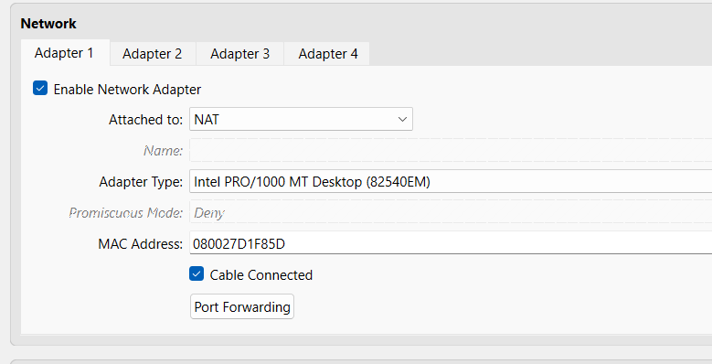

Lisäsin toiseen adapteriin "host-only"-adapterin.

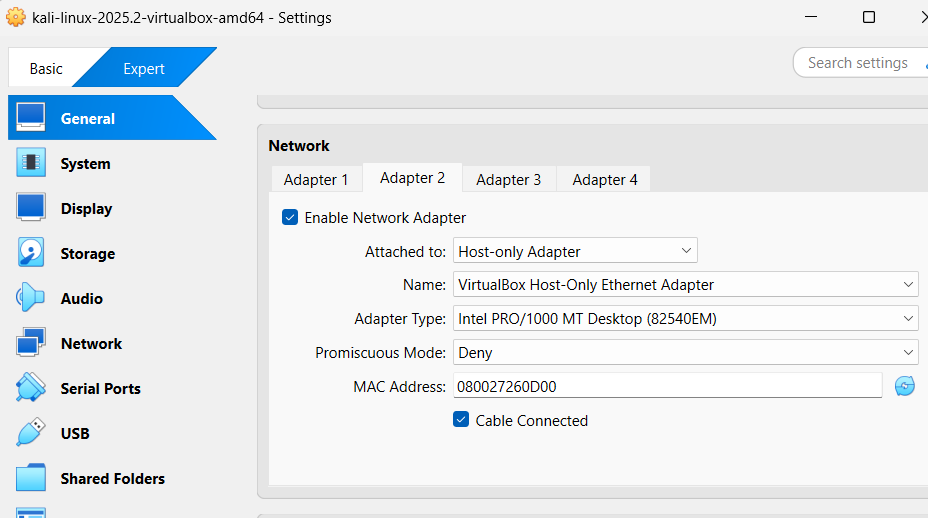

Kalin desktopin oikeasta yläkulmasta pystyy klikkaamaan "disconnect" ja näin katkaisemaan netin, mutta siinä pitää muistaa, kumpi on internet ja kumpi host-only-verkko. Muistin luennolta ohjeen, että Virtual Boxin Network-asetuksista voi "irrottaa kaapelin". Se on kätevämpi tapa katkaista Kalin nettiyhteys.

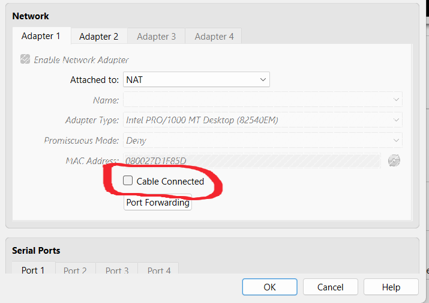

Metasploitableen laitoin vain host-only-adapterin.

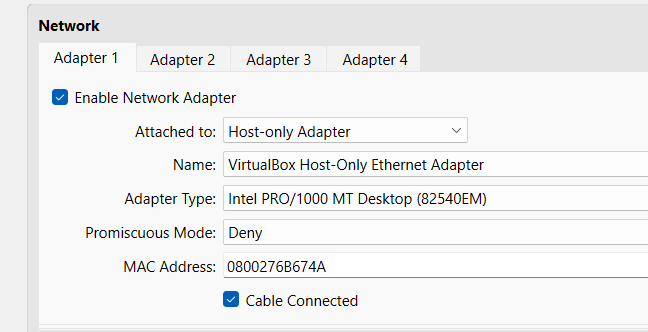

Host-only-verkon (automaattiset) DHCP-asetukset.

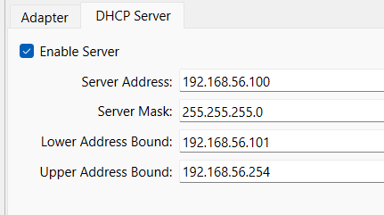

*c) Harjoittelemme omassa virtuaaliverkossa, jossa on Kali ja Metaspoitable. Osoita testein, että 1) koneet eivät saa yhteyttä Internetiin 2) Koneet saavat yhteyden toisiinsa.*

Metasploitablella pitäisi siis olla vain host-only-network Kalin kanssa, eikä yhteyttä nettiin.

Pingaus Metasploitablesta Kaliin ``ping 192.168.56.101`` toimi, mutta pingaus Googlen nimipalvelimeen  ``ping 8.8.8.8`` ei toiminut. Eli sen perusteella Metasploitable sai yhteyden Kaliin, mutta ei nettiin.

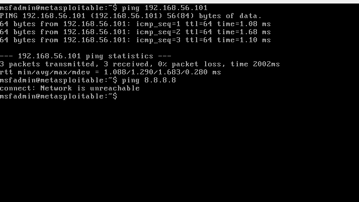

Ja samoin Kali pystyi pingaamaan Metasploitablea ``ping 192.168.56.102`` mutta ei Googlen nimipalvelua (kun "kaapeli oli irti" Virtual Boxin asetuksissa).

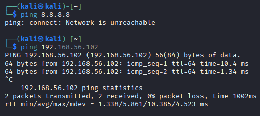

Kokeilin myös avata Kalista nettisivun ja Metasploitablesta käyttää curl-toimintoa johonkin nettisivuun, jotta näin etteivät nekään toimineet.

*d) Etsi Metasploitable porttiskannaamalla (nmap -sn). Tarkista selaimella, että löysit oikean IP:n - Metasploitablen weppipalvelimen etusivulla lukee Metasploitable.* 

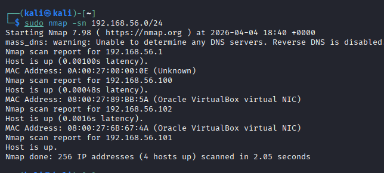

Skannasin aliverkon 192.168.56.0/24:    
1. Osoite .1 = Virtual Box Ethernet Adapter 
2. Osoite .100 = Virtual Boxin DHCP-palvelin 
3. Osoite .102 = Metasploitable 
3. Osoite .101 = Kali

Avasin Kalilla nettiselaimen ja menin Metasploitablen IP-osoitteeseen, josta löytyi tehtävässä mainittu sivu:

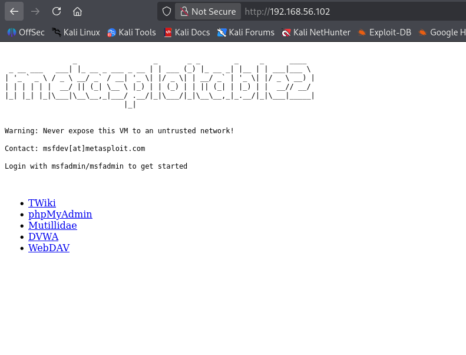

*e) Porttiskannaa Metasploitable huolellisesti ja kaikki portit (nmap -A -T4 -p-). Poimi 2-3 hyökkääjälle kiinnostavinta porttia. Analysoi ja selitä tulokset näiden porttien osalta. Voit hakea analyysin tueksi tietoa verkosta, muista merkitä lähteet.*

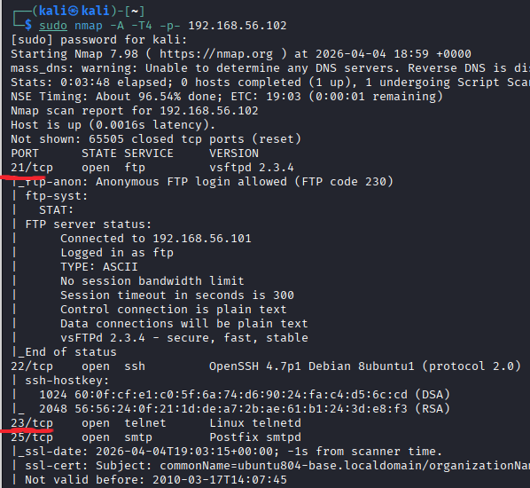

Portti 21: Ftp - Ftp on tiedostojensiirtoprotokolla, jonka liikenne ei ole salattua. Tuloksissa näyttäisi lukevan, että kyseinen palvelin sallii anonyymin sisäänkirjautumisen, eli sitä voisi kokeilla. Siellä näkyy myös versio vsftpd 2.3.4, jossa on aikoinaan ollut haavoittuvuus [CVE-2011-2523](https://www.cve.org/CVERecord?id=CVE-2011-2523). 

Portti 23: Telnet - Telnet on vanha tekniikka, jota ei pitäisi enää käyttää, koska sen liikenne ei ole salattua. 

*f) Vapaaehtoinen bonus: Sisään vaan. Pääsetkö murtautumaan Metasploitableen?*

Kokeilin helppoja tapoja, joilla ei tosin päässyt root-käyttäjään käsiksi. Ensin Telnet, eli luin [ohjetta](https://www.baeldung.com/linux/telnet), jossa oli luotu telnet-yhteys käyttäjällä "telnet", ja kokeilin samaa komentoa. Metasploitable vastasi, että väärä login, niin kokeilin käyttäjänimellä "msfadmin", ensin ilman salasanaa ja sitten salasanalla "msfadmin", ja yhteys aukesi. Ehkä niiden msfadmin-käyttäjätunnuksen ja salasanan käyttö on kuitenkin vähän huijaamista, koska en tietäisi niitä oikeassa kohteessa.

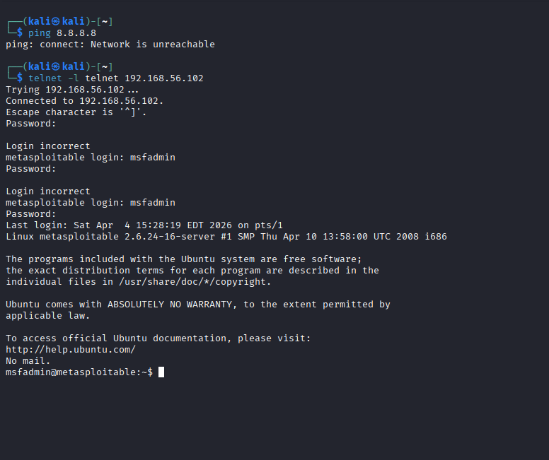

Kokeilin myös ftp:tä, koska nmapin tuloksissa oli sanottu, että anonymous-login on päällä. Komennolla ``ftp 192.168.56.102`` pääsinkin sisälle, mutta en pystynyt listaamaan sisältöä enkä luomaan esimerkiksi uutta hakemistoa.

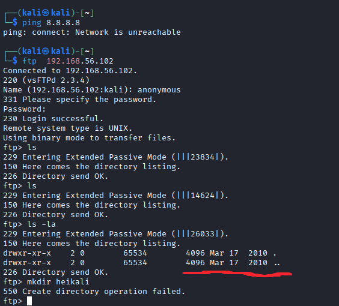

Kokeilin sitten uudelleen ja laitoin sekä käyttäjänimeksi että salasanaksi "msfadmin", ja nyt pystyin listaamaan hakemiston sisällön. Siellä näkyi jokin "vulnerable"-hakemisto, mutta sen enempää en asiaa tutkinut. 

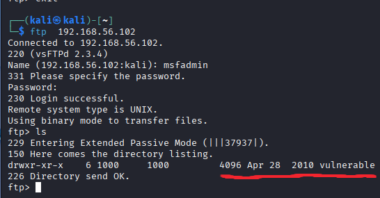

Koska tällä hetkellä käytän PostgreSQL-tietokantaa toisella kurssilla, niin senkin tietoturva kiinnostaa, joten päätin kokeilla vielä sitä.  Kokeilin [tämän sivun](https://www.offsec.com/blog/postgresql-exploit/) ohjeen mukaisesti eli komennolla ``psql -h 192.168.56.102 -p 5432 -U postgres`` ja tietenkin sillä pääsi sisälle. Kokeilin joitakin komentoja, mutta en saanut edes listatuksi mitään, ennen kuin kyselin ChatGPT:ltä (5.3 Instant), joka neuvoi erilaisia komentoja, joilla sainkin esille joitakin tauluja, mutta en ehtinyt niitä sen enempää kokeilla. Oli kuitenkin mielenkiintoista, että tietokantaan on mahdollista päästä noinkin helposti "ulkopuolelta" ilman minkäänlaista verkkosovellusta siinä välissä. Tosin tässä tapauksessa se oli tarkoituksella tehty helpoksi.

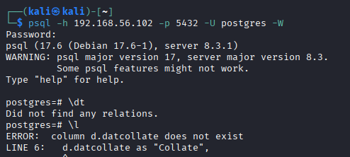

Lähteet: 

*[Karvinen 2026: Tunkeutumistestaus ](https://terokarvinen.com/tunkeutumistestaus/#h2-dora-the-explora)  
*[Setting Up Metasploitable in VirtualBox on Kali Linux](https://medium.com/cyber-collective/setting-up-metasploitable-in-virtualbox-on-kali-linux-1d5c3212f7f3)  
*[Using Telnet in Linux](https://www.baeldung.com/linux/telnet)  
*[PostgreSQL Exploit](https://www.offsec.com/blog/postgresql-exploit/)  
