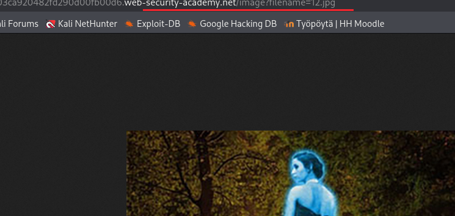

## h4 Täydellinen sertifikaatti

### x) Lue ja tiivistä  
OWASP 2021: OWASP Top 10:2021  
[A01-Broken Access Control](https://owasp.org/Top10/2021/A01_2021-Broken_Access_Control/index.html)

- Vuonna 2021 niistä sovelluksista, joista oli testattu broken Access control -heikkoudet, noin neljässä prosentissa niitä löytyi
- Access control varmistaa, että käyttäjät eivät voi tehdä sellaisia toimia, joita heidän ei pitäisi pystyä tekemään, esimerkiksi näkemään tai muuttamaan tietoja
- Tietoja saattaa saada luvatta esimerkiksi manipuloimalla URL:ia 
- Access control on tehokas vain, jos se tehdään palvelimen puolella tai serverless API:ssa, jossa hyökkääjä ei pääse muokkaamaan Access control -tarkistusta tai haun metadataa
- Hyökkäysten estämiseen on monta käytäntöä, joita kannattaa noudattaa, esimerkiksi webbipalvelimen hakemistojen listauksen estäminen
- Kannattaa logata epäonnistuneet Access control - epäonnistumiset

[Insecure direct object references (IDOR)](https://portswigger.net/web-security/access-control/idor)   
- IDOR on Access control -haavoittuvuuden tyyppi, jossa sovellus käyttää käyttäjän antamaa inputtia hakemaan objekteja suoraan
- Esimerkiksi jos tieto haetaan tietokannasta URL:issa olevalla numerosarjalla, voi numeroita muuttamalla päästä käsiksi sellaiseen tietoon, jonka ei ollut tarkoitus olla julkinen tai näkyvissä kyseiselle käyttäjälle.

[Path reversal](https://portswigger.net/web-security/file-path-traversal)

- Path reversal -hyökkäyksessä pyritään pääsemään webbi-sovelluksen kautta sellaisiin kansioihin, joihin ei pitäisi olla pääsyä
- Sovellukselle annettavaa URL:ia muokkaamalla pyritään saamaan sovellus hakemaan järjestelmän sisältä tietoja
- Vaikka sovelluksessa olisi tiettyjä suojatoimia, voi path reversal silti toimia, jos siinä käytetään tiettyjä tekniikoita
- Paras tapa estää path traversal on olla syöttämättä käyttäjältä tulevaa syötettä APIin
- Jos on pakko käyttää käyttäjältä tulevaa syötettä, sitä kannattaa esimerkiksi verrata sallittujen arvojen listaan tai varmistaa, että se sisältää vain sallitun tyyppistä sisältöä

[Cross-site scripting](https://portswigger.net/web-security/cross-site-scripting) (XSS)
- XSS-haavoituvuudessa hyökkääjä pääsee käsiksi sovellukseen ja sen dataan esiintymällä sellaisena käyttäjänä, jolla on sovelluksessa käyttöoikeuksia
- Haavoittuvaista sivua manipuloidaan niin, että se palauttaa käyttäjälle pahantahtoista JavaScript-koodia
- Kun koodi suoritetaan käyttäjän selaimessa, hyökkääjä pääsee manipuloimaan käyttäjän interaktiota sovelluksen kanssa
- XSS:n voi testata lisäämällä sivustolle JavaScriptin, joka sitten ajetaan omassa selaimessa. Yleinen tapa on kokeilla alert()-funktiota
- Pahantahtoinen koodi voi tulla HTTP-pyynnössä (Reflected XSS), nettisivun tietokannasta (Stored XSS) tai se voi olla client-side (DOM-based XSS).

### a) Totally Legit Sertificate. Asenna OWASP ZAP, generoi CA-sertifikaatti ja asenna se selaimeesi. Laita ZAP proxyksi selaimeesi. Laita ZAP sieppaamaan myös kuvat, niitä tarvitaan tämän kerran kotitehtävissä. Osoita, että hakupyynnöt ilmestyvät ZAP:n käyttöliittymään.

Asensin ZAPin komennolla ``sudo apt-get install zaproxy`` ja avasin sen komennolla ``zaproxy``. 

Katsoin ZAPin sivuilla introvideon ja [ohjesivun](https://www.zaproxy.org/getting-started/).

Sertifikaatti löytyi tehtävän vinkkien perusteella Option - Network - Server Certificates - kohdasta. Siinä oli valmis sertifikaatti, mutta generoin uuden.

Valitsin "Trust this CA to identify websites." Tallensin sertifikaatin ja lisäsin sen sitten Firefoxiin kohtaan Authorities. (Tätä kysyin ChatGPT:ltä, koska en muistanut mihin se laitetaan.)

Lisäsin Firefoxin asetuksissa proxyasetukset. Lähde [https://www.zaproxy.org/docs/desktop/start/proxies/](https://www.zaproxy.org/docs/desktop/start/proxies/)

Firefoxin about:config-sivulla piti myös laittaa "network.proxy.allow_hijacking_localhost" -> true.

Testasin Metasploitablella, että ZAP otti liikenteen.

Kuvien sieppauksen laitoin päälle ZAPin Display-asetuksista.

### b) Kettumaista. Asenna "FoxyProxy Standard" Firefox Addon, ja lisää ZAP proxyksi siihen. Käytä FoxyProxyn "Patterns" -toimintoa, niin että vain valitsemasi weppisivut ohjataan Proxyyn. 

Suljin ZAPin. Kokeilin refreshata Metan IPn, tuli "Proxy server is refusing connections". Menin Firefoxin asetuksiin -> No proxy.

Asensin Firefoxiin FozyProxy Standardin.

Lisäsin FoxyProxyyn 127.0.0.1 ja portin 8080. Ohje siihen näkyi hakutuloksissa, kun hain DuckDuckGolla, että miten ZAP lisätään FoxyProxyyn. Proxy by Patterns -kohtaan lisäsin localhostin ja PortSwiggerin labrasivut.

Testasin, että nettiliikenne menee suoraan Ylelle ja toisaalta PortSwiggerin osoitteet menevät ZAPin kautta.

### c) [Reflected XSS into HTML context with nothing encoded](https://portswigger.net/web-security/cross-site-scripting/reflected/lab-html-context-nothing-encoded)

Tehtävässä oli hakukenttä, johon pystyi kirjoittamaan syötteen. Kun hakusanan oli kirjoittanut, se näkyi seuraavalla sivulla. Alla olevassa kuvassa näkyy tyhjän haun tulokset. 

Pyrin kirjoittamaan hakuun jotain sellaista, joka ajaisi javascriptin selaimessani, kun päädyn haun tulossivulle. PortSwiggerin materiaaleissa kehotetaan käyttämään esimerkiksi alert-funktiota. 
Tein hakupyynnöt selaimessa ja katsoin sitten ZAPin käyttöliittymästä, minkä näköinen haun response oli, ja yritin muokkailla hakua niin, että responsessa näkyisi pätevää JavaScriptiä.

Eniten vaivaa aiheutti JavaScript, jonka syntaksia en muistanut, esimerkiksi puolipistettä koodin lopussa. Yritin ensin myös kirjoittaa "<script>" jotenkin niin, että kulmasulkeet olisi "escapattu", mutta lopulta huomasin, että ne pystyi kirjoittamaan hakukenttään suoraan. Sivulta [JavaScriptTutorial.net - JavaScript Alert](https://www.javascripttutorial.net/javascript-bom/javascript-alert/) löysin, että alert-viestissä pitää olla hipsut.

ZAPin käyttöliittymässä näkyi koodi, joka aiheutti selaimeeni alert-viestin.

Sivulla näkyi alert-viesti ja labra meni läpi.

### d) [Stored XSS into HTLM context with nothing encoded](https://portswigger.net/web-security/cross-site-scripting/stored/lab-html-context-nothing-encoded)

Tehtävässä oli blogi, jonka kirjoitusten alla pystyi jättämään kommentin. Käytin samaa metodia kuin edellisessä tehtävässä, eli lisäsin kommenttiosioon script-osion ja sen sisälle alert-funktion. Ensimmäisellä kerralla unohdin taas hipsut, ja kommentti meni läpi, mutta se oli tyhjä.

Toisella kerralla taisin kopioida syntaksin suoraan ZAP-infosivujen esimerkistä, koska siinä tuli mukana myös ylimääräinen p-tagi, jonka huomasin vasta raporttia kirjoittaessani.

Kun menin katsomaan kommenttiosiota, johon olin kommentin kirjoittanut, sieltä pompsahti alert-viesti.

Koodi näkyi taas myös ZAPissa. Siinä näkyy ylimääräinen p-tagi, joka ei vaikuttanut alert-funktion toimintaan.

### e) Selitä esimerkin avulla, mitä hyökkääjä hyötyy XSS-hyökkäyksestä. 

Hyökkääjä pääsee hyödyntämään sitä, että käyttäjän selain luottaa sivustoon. Hyökkääjän sivustolle laittamalla JavaScript-koodilla voidaan esimerkiksi kaapata käyttäjän eväste, jolla hyökkääjä voi kirjautua sisään ilman käyttäjän salasanaa.

### f) [File path traversal, simple case](https://portswigger.net/web-security/file-path-traversal/lab-simple)

Klikkasin selaimella sivustolla olevaa tuotteen kuvaa, josta aukesi tuotteen esittelysivu. Selaimen osoiterivin lopussa näkyi path /product?productId=1. Yritin muokata sitä vaihtamalla kysymysmerkin jälkeen labran infosivulla mainitun filename=../../../etc/passwd. Sivustolla näkyi valitus, että pyynnöstä puuttuu parametri "productid". 

Kokeilin joitakin vaihtoehtoja, mutta sain aina saman valituksen.

Tein sitten normaalin pyynnön eli klikkasin kuvaa, jotta pääsisin näkemään ZAPissa selaimen saaneen vastauksen ja tutkimaan sitä tarkemmin. Responsessa näkyi path, jolla sivulla oleva kuva haetaan eli ``/image?filename=12.jpg``.

Avasin sivulla oleva kuvan uudessa ikkunassa, jotta pääsin suoraan manipuloimaan sen hakua selaimen osoitekentässä.

Vaihdoin siis URL-osoitteeksi /image?filename=../../../etc/passwd, ja selaimessa näkyi uusi ilmoitus.

Katsoin ZAPissa kyseisen pyynnön kohdalta responsen GET:image(filename) ja siellä Body:Text. Siellä näkyi haluttu passwd-tiedosto.

### g) [Lab: File path traversal, traversal sequences blocked with absolute path bypass](https://portswigger.net/web-security/file-path-traversal/lab-absolute-path-bypass)

Tein tässä samalla tavalla kuin edellisessä kohdassa, mutta suhteellisen osoitteen sijasta vaihdoin kuvan hakuosoitteeksi ``image?filename=/etc/passwd``. Tämä vinkki oli kerrottu kyseisten labrojen [infosivulla](https://portswigger.net/web-security/file-path-traversal).

ZAPin response-ikkunassa näkyi taas salasanatiedosto.

### h) [Lab: File path traversal, traversal sequences stripped non-recursively](https://portswigger.net/web-security/file-path-traversal/lab-sequences-stripped-non-recursively)

PortSwiggerin path traversal -infosivulla neuvotaan, että "You might be able to use nested traversal sequences, such as ....// or ....\/. These revert to simple traversal sequences when the inner sequence is stripped." En ihan käsittänyt, mitä siinä tarkoitetaan, mutta kokeilin erilaisia piste-kombinaatioita.

Lopulta tajusin, että siinä piti laittaa kolme kertaa ....//, koska silloin systeemi poistaa aina pari pistettä ja yhden vinoviivan. Jäljelle jää path, jolla päästään käsiksi oikeaan tiedostoon. Salasanatiedostosta en enää ottanut kuvaa, mutta tämäkin labra meni siis läpi.

ZAPissa näkyy lähetetty pyyntö.

### i) [Lab: Insecure direct object references](https://portswigger.net/web-security/access-control/lab-insecure-direct-object-references)

Labrasivulla oli chat-sivu, johon pystyi kirjoittamaan jotain ja klikkaamaan Send. Kun näin tein, niin teksti katosi. Chat-toiminto ei siis toiminut, mutta en tajunnut tehtävää tehdessäni, ettei kyse ollut sivustosta, vaan siitä, että proxyn käyttö rikkoi chatin.

Klikkasin View Transcript -nappia, jolloin ruudulle ilmestyi teksti "Disconnected", ja selaimeni latasi jonkin tekstitiedoston. Tekstitiedosto oli tyhjä. Jos klikkailin Send-nappia enemmänkin ja sitten kokeilin View Transcript -nappia, niin tekstitiedostoon tuli vain teksti "Disconnected".

ZAPin POST-pyynnössä näkyi osoite, joka päättyi .web-security-academy.net/download-transcript. GET-pyynnössä oli osoite /download-transcript/6.txt ja sama osoite näkyi responsessa. 

GET-pyyntö.

Vastaus, tosin eri chat-tiedostosta.   

Jos klikkasin View Transcript -nappia uudelleen, niin numero kasvoi. Mietin sitä, että onko sillä merkitystä, että olenko ensin klikannut Send-nappia ja vasta sitten View Transcript, mutta en saanut niistä oikein mitään järkevää tietoa ulos.

Tehtävään liittyvässä [ohjeessa](https://portswigger.net/web-security/access-control/idor) annettiin esimerkkiosoite "`https://insecure-website.com/static/12144.txt`". Tämän vinkin takia ajattelin, että oikean chat-tiedoston numero saattaisi olla jokin hyvinkin satunnainen ja iso numero. En keksinyt muuta tapaa kuin käyttää Fuzzia ja yrittää sillä etsiä oikea tiedosto. Kokeilin muutaman kerran fuzzia ja sitten päätin luovuttaa, koska en keksinyt enää mitään uutta lähestymistapaa.

Jälkikäteen ajattelin, että olinkohan fuzzannut liian aggressiivesti, ja että onkohan labrassa jotain sääntöjä siihen liittyen. En edes tiennyt, mitä asetuksia ZAPin Fuzz käyttää. En löytänyt käyttöehdoista muuta, kuin että ei saa ladata viruksia tai tehdä DDOS-hyökkäystä jne. Kysyin asiasta ChatGPT:ltä, ja se sanoi, että fuzzaaminen on sallittua, mutta että olisin kyllä voinut fuzzata pienemmillä asetuksilla. 

En siis keksinyt enää muuta, joten katsoin tehtävän ratkaisun. Siinä olisi pitänyt katsoa vain tekstitiedosto numero 1, jossa salasana oli. En ollut tehnyt tehtävää kovinkaan systemaattisesti, ja olin siis täysin jättänyt huomiotta ensimmäisen tekstitiedoston. Olin myös hämääntynyt vinkistä ja osittain ehkä myös siitä, että chat ei toiminut. 

Epäilin jossain vaiheessa myös sitä, että chat ei toiminut siksi, etten ollut kirjautunut sisään, koska minulla ei ollut käyttäjätunnusta kyseisessä labrassa. Se ikään kuin simuloisi oikeaa tilannetta, jossa hyökkääjällä ei ole sivustolle käyttäjätunnusta.

Vaikka olin katsonut jo tehtävän vastauksen, niin suoritin sen vielä kerran fuzzaamalla. Tällä kertaa löysin ja muutin Fuzziin ei-aggressiiviset asetukset ja suoritin GET-pyynnön, jossa käytiin läpi tiedostot 1-10.txt.

Fuzzin asetukset  

GET-pyynnön kohta, jota fuzzataan.  

Fuzzataan numerot 1-10.  

Tuloksista löytyi chat-tiedosto ja siellä salasana.  

Lopuksi loggasin Carlosin salasanalla sisään.

Raporttia viimeistellessäni testasin viimeistä labraa omalla läppärini selaimella, ja siellä näkyi chat ihan eri tavalla, eli se toimi ja siihen pystyi kirjoittamaan. Testasin myös Kalissa ilman proxya ja se toimi sielläkin. Olisi siis kannattanut kokeilla sivun toimintaa ensin ilman proxya, niin en olisi niin kauaa ihmetellyt chatin omituista toimintaa.

### Lähteet

- [Tehtävänanto: Tunkeutumistestaus h4](https://terokarvinen.com/tunkeutumistestaus/#h4-taysin-laillinen-sertifikaatti)
- ChatGPT 5.3 Instantin kanssa olen käynyt keskusteluja erilaisten asioiden ymmärtämisestä, mutta jos sitä on käytetty suoranaisena lähteenä, niin sen olen aina pyrkinyt mainitsemaan. Myös muut lähteet mainittu tekstin seassa.
