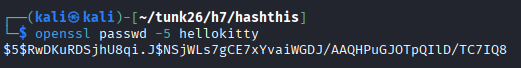
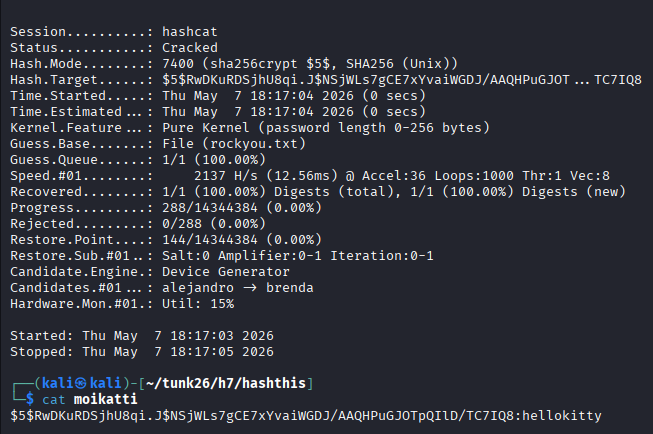

## h7 Toukokuu2026!

### x) Lue/katso ja tiivistä. 
[Karvinen 2022: Cracking Passwords with Hashcat](https://terokarvinen.com/2022/cracking-passwords-with-hashcat/)

- salasanojen hashit ovat yksisuuntaisia, mutta Hashcatilla voidaan kokeilla erilaisten salasanojen hasheja ja testata, vastaako hash murrettavaa hashia
- murtamisessa voidaan käyttää esim. Rockyou-sanakirjaa, jossa on yli 14 miljoonaa salasanaa
- komennolla ``hashid -m HASH`` voidaan yrittää selvittää, mitä hash-algoritmia on hashissa on käytetty, esim. MD5 = 0
- kannattaa käyttää muuta kuin virtuaalikonetta, niin hashien läpikäynti toimii tehokkaammin

[Karvinen 2023: Crack File Password With John](https://terokarvinen.com/2023/crack-file-password-with-john/)

- John the Ripperillä voidaan murtaa erilaisten tiedostojen salasanoja esimerkiksi sanakirjahyökkäyksellä tai brute forcella
- artikkelissa käännetään työkalu lähdekoodista, jotta siinä olisi mahdollisimman paljon ominaisuuksia
- ``./configure``-komennolla tunnistetaan ympäristö ja tehdään Makefile
- salatusta tiedostosta erotetaan ensin hash ja sitten yritetään murtaa se
- zip-tiedostojen lisäksi John the Ripper murtaa lukuisia muitakin formaatteja

### a) Asenna Hashcat ja testaa sen toiminta murtamalla esimerkkisalasana.

Kalissa oli valmiina Hashcat ja Hashid. Latasin rockyou-sanalistan komennolla  ``wget https://github.com/danielmiessler/SecLists/raw/master/Passwords/Leaked-Databases/rockyou.txt.tar.gz`` ja purin sen tar-komennolla.

Tein salasanan hashin openssl-työkalulla. 


Vaihtoehto -5 tekee hashin SHA256-algoritmilla.



Yritin käyttää hashid-työkalua hashin algoritmin tunnistamiseen, mutta se antoi usein ihan vääriä vaihtoehtoja. 

Syötin salasanan hashin Hashcatille ``hashcat -m 7400 'HASH' rockyou.txt -o moikatti``. 7400 on SHA256:n tyyppi, jolla kerrotaan hashcatille mitä algoritmiä sen tulee käyttää. Lähde: [Hashcat.net - Wiki: Example hashes](https://hashcat.net/wiki/doku.php?id=example_hashes)

Salasana selvisi muutamassa sekunnissa.



Kokeilin erilaisia salasanoja. Esimerkiksi "catdog" selvisi sekunneissa, ja "catdog!" kesti sen verran, etten jaksanut odottaa, selviääkö se. Se riippuu vain siitä, onko salasana listalla, ja missä kohtaa listaa.

### c) Asenna John the Ripper ja testaa sen toiminta murtamalla jonkin esimerkkitiedoston salasana.

Käytin samaa komentoa kuin ohjesivulla eli ``sudo apt-get -y install micro bash-completion git build-essential libssl-dev zlib1g zlib1g-dev zlib-gst libbz2-1.0 libbz2-dev atool zip wget``, mutta sain virheilmoituksen paketista ``zlib1g-dev``, joten poistin sen. Muutkin ohjelmat taisivat olla jo valmiina koneella.


Kloonasin John the Ripper -repon.


Komento ``./configure`` tunnisti ympäristön ja teki Makefilen.


Configuren tulosteessa näkyi seuraavaksi tarvittava komento ``make -s clean && make -sj4``. Sen suorittamisessa meni muutama minuutti.


Tein zip-tiedoston, jonka salasanasin vaihtoehdolla -e.


Erotin hashin tiedostosta zip2john-komennolla.


Sitten john-komennolla ratkaisin sen.


### e) Tiedosto. Tee itse tai etsi verkosta jokin salakirjoitettu tiedosto, jonka saat auki. Murra sen salaus. (Jokin muu formaatti kuin aiemmissa alakohdissa kokeilemasi).

Tein host-koneessa Excel-tiedoston, jonka salasin salasanalla. Komennolla ``python office2john`` erotin siitä hashin.


Sitten yritin murtaa salasanan john-komennolla ja käyttämällä rockyou-sanalistaa. Läppäristäni alkoi loppua akku, enkä viitsinyt laittaa virtajohtoa kiinni murtamisen aikana, koska kone vaikutti kuumenevan liikaa. Lopulta pysäytin murtamisen kesken. Salasana oli rockyou-listassa, joten eiköhän john olisi sen lopulta löytänyt.

Kun john pyörii, voi kysymysmerkkiä painamalla nähdä, mitä se milloinkin tekee.


  
### f) Tiiviste. Tee itse tai etsi verkosta salasanan tiiviste, jonka saat auki. Murra sen salaus. (Jokin muu formaatti kuin aiemmissa alakohdissa kokeilemasi. Voit esim. tehdä käyttäjän Linuxiin ja murtaa sen salasanan.)
Tein Kaliin uuden käyttäjän "crackmypw" ``sudo adduser`` -komennolla.

Hain ensin /etc/passwd ja /etc/shadow -tiedostosta uuden käyttäjänimen tiedot ja tein niistä uudet tiedostot. Komennoissa auttoi ChatGPT.


Unshadow-komennolla yhdistin ne yhdeksi tiedostoksi. Lähde: [John the Ripper usage examples](https://www.openwall.com/john/doc/EXAMPLES.shtml)


Selvitin salasanan johnilla ja rockyou-listalla. John tunnisti algoritmin (yescrypt) automaattisesti.


### g) Sanakirja. Oman sanakirjan teko parantaa onnistumismahdollisuuksia. Demonstroi, kuinka teet oman sanakirjan hashcat:n tai john:iin.

Kloonasin Cupp-ohjelman (Common User Password Profiler) GitHubista.


Cuppia ajetaan Pythonilla.


Interaktiivisessa moodissa Cupp kyselee kohteen tietoja, joilla voidaan tehdä juuri kyseiselle kohteelle sopiva salasanoja. Syötin siihen fiktiivisiä tietoja kohteesta.


Cupp teki sanalistan, joka perustuu antamiini kohteen tietoihin. Nyt sitä voisi käyttää esimerkiksi Hashcatissa tai John the Ripperissä.


### h) Hash rules. Näytä esimerkki HashCatin sääntöjen käytöstä (rules).

Hash-säännöillä voidaan muokata salasanoja ja testata niiden erilaisia variaatioita, koska ihmiset usein esimerkiksi lisäävät jonkin numeron salasanan loppuun.

Hashcatissa on valmiina erilaisia sääntöjä:


Esimerkiksi top10_2025-säännöt ovat tällaiset:


Eli 

```
: - ei tee muutosta  
$1 - lisää loppuun numeron 1  
$1 $2 - lisää loppuun numerot 1 ja 2  
$1 $2 $3 - lisää loppuun 123  
c - ensimmäinen kirjain isolla  
u - kaikki kirjaimet isolla  
$! - lisää loppuun huutomerkin  
d - tuplaa kaikki merkit  
so0 si1 se3 ss$ sa@ - korvaa o -> 0, i -> 1 jne.  
$2 $0 $2 $5 - lisää loppuun 2025  
```
Lähde:[Hashcat wiki - Rule-based Attack](https://hashcat.net/wiki/doku.php?id=rule_based_attack)

Tein listan, jossa on kolme salasanaa: password, 123456 ja helloworld. Käytin listaan top10_2025-sääntöä: ``hashcat --stdout passwords.txt -r /usr/share/hashcat/rules/top10_2025.rule > rulespasswords``. Jotkin salasanat tulivat listaan useammin kuin kerran, koska esimerkiksi numeroiden muuttaminen isoiksi tai pieniksi ei tee niille mitään, joten sorttasin listan ``sort -u rulespasswords.txt -o rulespasswordsnodupes.txt``. Komennoissa auttoi ChatGPT.

Kolmesta alkuperäisestä salasanasta tehdyt variaatiot:


### i) Lippuvalmistelu. Valmistele kone ensi viikon lipunryöstöön. Tästä kohdasta ei tarvita kattavaa raporttia, riittää pelkkä luettelo siitä, miten ratkaisit allaolevat kysymykset. Jos sinulla on esimerkiksi valmis, toimiva Kali VM tavallisella PC:llä, tässä ei tarvitse tehdä juuri mitään.

- Käytössä Kali VM Windows-läppärillä
- Kalista saa netin poikki ottamalla virtuaalikoneen "kaapelin" irti tai Ethernetin "disconnect" ja pingiä kannattaa aina kokeilla
- Varmistan etukäteen, että pääsen myös Laksuun Kalilla
- Kalissa ei pitäisi olla muita kuin kursseilla käytettyjä ohjelmia ja työkaluja
- Siivosin Kalia, enkä löytänyt sieltä muistiinpanoja, eikä minulla ole tapana niitä Kaliin kirjoittaakaan. En ole Kalissa sisäänkirjautuneena GitHubiin, joten en näe siellä yksityisiä repojani
- En käytä tekoälyä lipunryöstössä.

## Lähteet
- [Terokarvinen.com - Tunkeutumistestaus h7](https://terokarvinen.com/tunkeutumistestaus/#h7-toukokuu2026)
- [Karvinen 2022: Cracking Passwords with Hashcat](https://terokarvinen.com/2022/cracking-passwords-with-hashcat/)
- [Karvinen 2023: Crack File Password With John](https://terokarvinen.com/2023/crack-file-password-with-john/)
- [Hashcat wiki - Rule-based Attack](https://hashcat.net/wiki/doku.php?id=rule_based_attack)
- [Hashcat.net - Wiki: Example hashes](https://hashcat.net/wiki/doku.php?id=example_hashes)
- [John the Ripper usage examples](https://www.openwall.com/john/doc/EXAMPLES.shtml)
